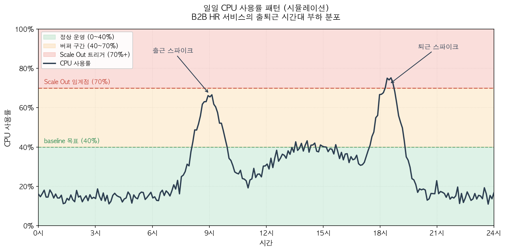
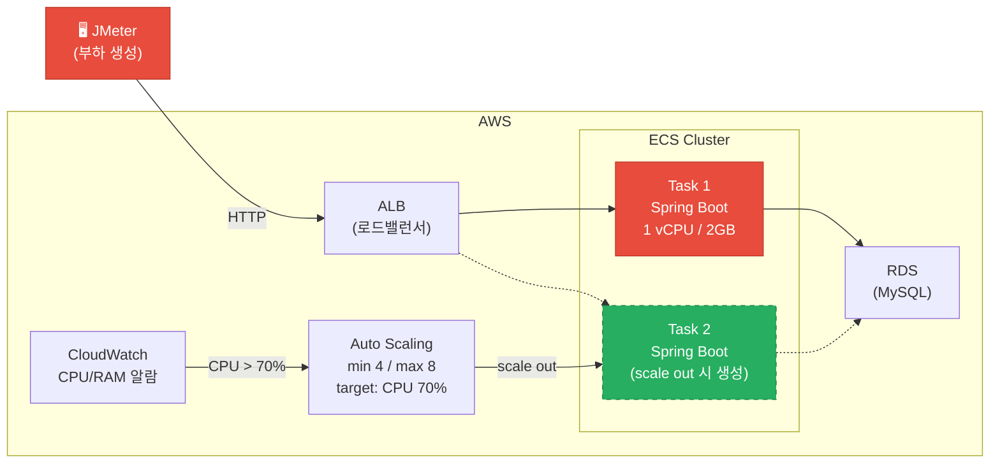
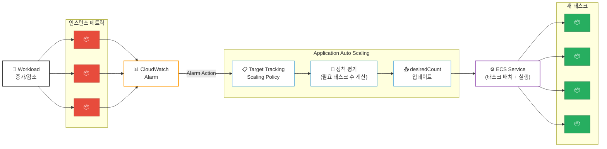
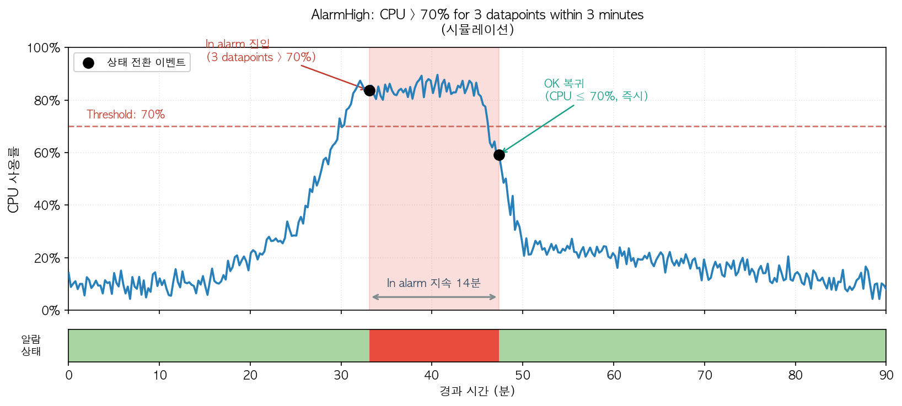
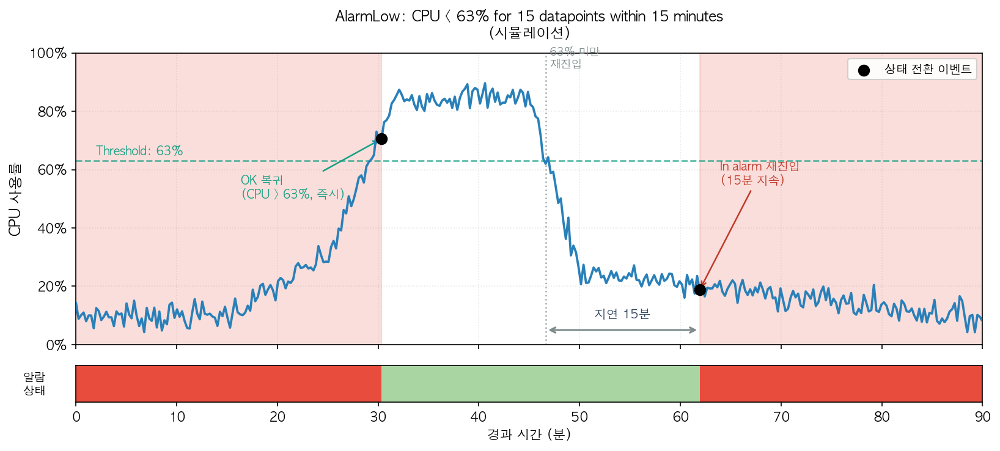

## 1. 서비스 오픈 대비하여 Auto Scaling 켜기

팀에서 담당하는 서비스 오픈이 임박하게 되었고, 가용성 확보를 위해 ECS에 Auto Scaling을 적용해야 했다. 백엔드 팀 내에는 인프라 작업 경험자가 없었고 주니어 입장에서 서비스를 이해하는데 도움될것으로 판단하여 자원하였다. 요청된 작업은 기존에 작성된 AWS CDK를 수정해서 Auto Scaling을 적용하는 것이었다. 개인적으로 인프라 자체도 익숙하지 않았지만, 인프라를 코드로 관리하는 방식인 CDK를 먼저 학습하고 적용하는 과정이 이 작업의 가장 큰 병목점이라고 생각했다. 하지만 적용하는 과정에서 해야했던 고민들과 경험들은 단순하지 않았기 때문에 정리해서 공유한다.

## 2. Auto Scaling 기준값(target value)은 어떻게 판단할까?

당시 상황을 설명하자면, 프로덕션 서버는 몇 개월 운용되었지만 오픈되지 않았기 때문에 의미있는 트래픽을 받아본적이 없었다. 따라서 프로덕션임에도 불구하고 서버 스펙은 낮게(0.5 vCPU, 2GB) 유지해왔다. B2B HR 서비스 특성상 출퇴근 시간대에 트래픽 스파이크가 발생한다. 따라서, 이 근태 데이터의 신뢰성이 중요하다. 8시간을 딱 맞추고 퇴근하고 싶은데 아침에 서비스가 느려서 몇 분 늦게 타각되거나 서비스가 잘 동작하지 않는다면 사용자 입장에서는 그 서비스를 더 이상 사용하고 싶지 않다고 느낄것 같다.

서버 스펙이나 Auto Scaling이 적용되는 기준에 대해 먼저 레퍼런스를 조사했다. AWS, GCP 공식문서에서는 트래픽에 따른 서버 스펙의 분명한 기준점을 제시하지 않았다. GCP에서는 ["애플리케이션을 새 VM에서 초기화하는 데 시간이 오래 걸리는 경우 대상 CPU 사용률을 85% 이상으로 설정하지 않는 것이 좋습니다."](https://docs.cloud.google.com/compute/docs/autoscaler/scaling-cpu?hl=ko)를 확인할 수 있었다. AWS 공식 문서에는 ["To use resources cost efficiently, set the target value as high as possible with a reasonable buffer for unexpected traffic increases."](https://docs.aws.amazon.com/autoscaling/ec2/userguide/as-scaling-target-tracking.html)를 확인할 수 있었다. 사실상 두 레퍼런스는 명확한 기준을 제시하지 않고 결국 서비스 특성을 고려해서 직접 판단해야한다.

우리 서비스는 MSA로 이미 HR의 일부 분야에서는 성공적으로 서비스를 운용중이었다. 해당 서버의 메트릭(Metric)과 목표값(Target value)을 참고했을때 CPU와 RAM Usage의 70퍼센트에서 scale out됨을 파악할 수 있었다. 다만 해당 서비스는 루비온레일즈로 백엔드 서버를 운용중이어서 지금 서비스의 자바 스프링 백엔드와의 기준점은 분명히 다를 것이다. 

**그럼에도 적절한 시작포인트가 필요했기 때문에** 동일하게 CPU, RAM Usage의 70퍼센트에서 scale out 되도록 했다. 또한, 서비스 신뢰성을 위해 0.5 vCPU에서 1 vCPU로 스펙업을 했고 최소/최대 태스크 수도 기존 서비스와 동일하게 min 4 / max 8로 설정했다. HR 서비스 신뢰성 측면에서 30~40퍼센트 정도의 usage가 나오도록 했을때 이 두 배에 해당되는 70퍼센트에서 scale out되도록 한다면 출퇴근 스파이크를 대비하는 버퍼 역할을 할것으로 예상했다. 아래 그림에서 HR서비스의 일반적인 트래픽 패턴과 여기서 논의한 메트릭과 목표값을 이해하기 쉽게 시각화하였다.

**초기값은 이렇게 정하고 서비스 안정화가 이뤄지고 실제 유의미한 트래픽이 생겼을때 서버 스펙을 조절해서 운용 usage가 30~40이 나오도록 맞추면 될것이다.** 이런 방식으로 Auto Scaling은 트래픽이 많이 발생하는 9시 - 18시 사이에는 scale out되고 주말을 포함한 저녁과 새벽 시간대에는 자동으로 scale in되어서 불필요한 인스턴스 유지 비용을 절감할 수 있을것이다. 

## 3. JMeter로 부하 테스트: 동작 검증

섹션1에서 언급했듯이 CDK 학습이 병목이라고 생각했지만 Auto Scaling을 설정하고 나니 자연스럽게 **"이걸 어떻게 증명할건데?"** 와 같은 질문을 하게되었다. 따라서 JMeter로 서버에 부하를 걸어서 언제, 어떻게 scale out, scale in 하는지 확인하기로 했다.

### 실험 환경

- 클러스터: 테스트 클러스터
- 대상 API: 휴가 조회 API
- 스펙: **1 vCPU / 2GB Memory** (프로덕션과 동일하게 맞춤)
- 부하 도구: JMeter

테스트용 클러스터가 있었고 다른 환경(스테이징, 덤프 등)은 이미 다른 팀에서 사용중이라 제외했다. 부하 종류와 상관없이 결국 Auto Scaling이 알람에 맞춰서 동작하는지 체크하는게 목적이었기 때문에 단순한 API를 선택해서 로컬에서 AWS 클라우드에 있는 서버로 부하를 발생시켰다. 이해를 위해 전체 아키텍처와 트래픽에 따른 서버 부하 상태를 구별하여 아래 그림으로 표현했다.

### Thread 수를 단계적으로 올리며 CPU 관찰

JMeter와 부하테스트는 생소했기 때문에 **테스트 자동화를 하지 않고 최대한 단순하게 목적에 집중**했다. 대신 스레드 수를 1에서 80까지 단계적으로 올렸고, 각 단계에서 CPU 부하가 평평해질 때까지 기다렸다가 안정화가되면 다음 단계로 넘어가는 수동방식으로 진행했다. 각 스레드는 요청을 보내고 응답을 받으면 1초 대기(Timer) 후에 다시 요청하도록 했다. 아래 테이블에 스레드 수에 따른 CPU, Memory 사용률을 정리했다.

| Threads | Ramp-up | Loop | Timer | CPU (%) | Memory (%) |
|---------|---------|------|-------|---------|------------|
| 1 | 1s | infinite | 1000ms | 3 | 29.7 |
| 5 | 1s | infinite | 1000ms | 9.76 | 29.87 |
| 20 | 1s | infinite | 1000ms | 33.16 | 29.98 |
| 50 | 1s | infinite | 1000ms | 62.51 | 30.1 |
| 80 | 1s | infinite | 1000ms | **93** | 29.8 |

- Ramp-up: 모든 스레드를 시작하는데 걸리는 시간 (1초: 거의 동시에 시작하기 위해 설정)
- Timer: 요청-응답 이후 다음 요청까지 대기 시간 (1000ms: 사용자가 1초마다 클릭하는 패턴)
- Loop: 요청-응답을 얼마나 반복할지 (infinite: 수동 종료할때까지 부하를 주기 위해 설정)
- Threads: 동시 사용자 수를 의미 (K6의 VU(Virtual User) 개념과 유사)

결과적으로 스레드 수에 따라 CPU 사용률이 높아지는 것을 확인할 수 있었다. 단계별로 올라서 결국 80개의 스레드가 동시에 요청을 보낼때 CPU 사용률이 93퍼센트까지 높아졌다. 하지만 Memory 사용률은 영향을 받지 않았는데, 이 테스트에 CPU Bound의 단순 조회 API를 사용했기 때문에 예상된 결과였다.

## 4. Scale Out 관찰과 grace period 이슈

실험을 통해 scale out과 scale in을 관찰할 수 있었지만 동작 방식을 정확히 이해할 필요가 있었다. 이해하지 못하면 예상치 못한 동작으로 문제가 발생할 수 있고, 원하는 방식으로 컨트롤할 수 없기 때문이다.

특히 CDK와 콘솔로 작업하게 되면 AWS가 제공하는 추상화에 의해 많은 동작들이 가려져 있음을 이번 경험을 통해 알 수 있었다. 예를 들어, CPU Usage 70%에서 scale out하는 설정을 입력했다면 내부적으로는 CloudWatch 알람 생성, 메트릭 집계, 양방향 트리거 등 여러 메커니즘이 존재한다. 따라서, 관찰 결과를 전달하기 전에 AWS Auto Scaling이 CloudWatch와 함께 어떻게 동작하는지 정리하려고 한다.

### CloudWatch 알람의 동작 원리

아래 그림은 AWS 공식 문서 ["How target tracking scaling for Application Auto Scaling works"](https://docs.aws.amazon.com/autoscaling/application/userguide/target-tracking-scaling-policy-overview.html)에 있는 다이어그램을 좀더 이해하기 쉽게 재생성했다. 특히 해당 문서의 ["How it works"](https://docs.aws.amazon.com/autoscaling/application/userguide/target-tracking-scaling-policy-overview.html#target-tracking-how-it-works)과 ["Considerations"](https://docs.aws.amazon.com/autoscaling/application/userguide/target-tracking-scaling-policy-overview.html#target-tracking-considerations) 섹션은 원문으로 읽어볼만 하다.

먼저 Auto Scaling을 위해 메트릭과 목표값을 CPU, Ram usage 70%으로 정했다. 이 설정값으로 AWS Cloudwatch는 두 개의 Alarm을 생성한다. 하나는 scale out 목적의 alarmHigh, 다른 하나는 scale in 목적의 alarmLow가 명칭으로 생성된다. 참고로 메트릭은 데이터 수집이 적어도 1분의 interval을 갖는 대상을 선택하기를 권고한다. 너무 긴 interval은 급격한 트래픽 변경에 빠르게 대응하기 어려워지기 때문이다. alarmHigh는 사용자가 입력한 CPU, Ram Usage 70%로 설정된다. 반면에 alarmLow는 설정값보다 10퍼센트 적은 63%로 설정된다. 이에 대한 설명은 위에서 언급한 레퍼런스에 다음과 같은 문장을 통해 확인할 수 있다:

"In this case, it slows down scaling by removing capacity only when utilization passes a threshold that is far enough below the target value (usually more than **10% lower**) for utilization to be considered to have slowed."

트래픽이 증가할 때 scale out은 사용자가 설정한 값(70%)에서 즉각 발생해야 한다. 반면 scale in은 트래픽이 충분히 안정화되었다고 판단될 때까지 보수적으로 미뤄지는데 그 기준을 목표값의 10% 이상 낮은값(63%)에서 발생하게 한다.

발생한 알람은 등록된 **Alarm Action**을 통해 Application Auto Scaling 서비스에 직접 전달된다. (SNS 알림이 아니라 AWS 내부의 서비스-투-서비스 호출이다. Target Tracking Policy를 만들면 AWS가 자동으로 알람의 action에 scaling policy ARN을 등록해주기 때문에 사용자가 따로 연결할 필요가 없다.) Application Auto Scaling은 정책에 따라 "몇 개의 태스크가 필요한지" 계산하고 ECS Service의 desired count를 업데이트한다. 그 이후의 실제 작업 — 새 태스크 배치, Docker 이미지 pull, 컨테이너 실행, ALB Target Group에 자동 등록 — 은 ECS Service가 처리한다. **즉, Application Auto Scaling의 책임은 "desired count를 업데이트하는 것" 한 가지**이고, 나머지는 다른 AWS 서비스가 마무리한다.

이런 책임 분할의 장점은 디버깅이 쉬워진다는 것이다. 알람이 안 울리면 CloudWatch 문제, desired count가 안 바뀌면 Application Auto Scaling 문제, 태스크가 안 뜨면 ECS Service 문제, 트래픽이 안 오면 ALB / health check 문제로 좁혀나갈 수 있다.

### 태스크 1개 abort

- 80 threads로 CPU 93%에 도달한 상태에서 desired count를 2로 변경
- 새 태스크 시작 → **1개 abort, 결국 2대로 안착**
- 원인: **grace period를 설정하지 않았음**
  - 앱이 아직 부팅 중인데 health check가 실패 → ECS가 태스크를 죽임
  - grace period 개념 자체를 몰랐던 상태

### 태스크 활성화까지의 시간

- task startUp → task active: **약 4분**
- 이 4분은 Spring Boot 부팅만이 아니라 전체 파이프라인:
  - ECS 태스크 스케줄링 (AWS 내부, 제어 불가)
  - Docker 이미지 pull
  - Spring Boot 앱 부팅
  - health check 통과
- 프로덕션(1 vCPU) 실측: `Started OptimizApplication in` → **85~90초**
- 테스트 환경(0.5 vCPU)에서는 부팅만 ~3분으로 추정, 나머지가 스케줄링/pull

### Grace Period 설정

- 부팅 포함 전체 파이프라인 약 4분 → **grace period 5분으로 설정**
- 이후 태스크 abort 문제 해결

### Scale Up 후 안정화

- 2대 활성 후 CPU **52.76%**로 안정화
- 부하가 균등하게 분배됨

## 5. Scale In 관찰

- 부하 중단 (21:06) → scale down 알람 (21:23): **약 17분**
- 실제 알람까지 약 2분의 지연시간 존재

<!-- cooldown period 설정값 보충 -->

## 6. 운영 후 발견한 한계: RAM 기준의 문제

### 문제 발생

- 서비스가 성장하면서 새로운 기능 추가 → lazy loading으로 인해 **RAM baseline이 지속 상승**
- RAM 사용률이 65% 기준을 항상 초과 → **scale in이 안 됨**
- 인스턴스가 불필요하게 계속 떠 있는 상태

### 팀별 대응

- **다른 팀**: RAM 기준 제거, CPU만으로 scaling 전환
- **우리 팀**: Auto Scaling 정책을 건드리지 못하고 RAM을 2GB → 4GB로 **스펙업** (시니어 판단)
  - 비용으로 문제를 회피한 셈

### 내 판단: 근본 원인은 워크로드 미분리

- 하나의 서버가 **API 트래픽 + 백그라운드 작업**을 모두 처리
- 백그라운드 작업이 RAM을 점유하면서 baseline을 끌어올림
- API 서버 / Worker 서버를 분리했다면:
  - 각각 독립적인 scaling 정책 적용 가능 (API → CPU 기반, Worker → 큐 depth 기반 등)
  - RAM baseline이 낮아져서 스펙업 불필요

## 7. Startup 시간 분석

### liquibase가 병목이라는 추측

- ECS에서 부팅 시간이 길어서, liquibase changelog 검증이 주범이라고 추측

### 로컬 실측 (2026-04-06)

| 조건 | 부팅 시간 |
|------|----------|
| liquibase on | 68초 |
| liquibase off | 62초 |
| **차이** | **~6초 (~9%)** |

- **liquibase는 병목이 아니었다**
- 나머지 62초의 대부분은 Bean/Repository 초기화로 추정 (Spring Data JPA + Redis repository 스캔 로그 다수 관찰)
- 단, 로컬 측정에는 Docker Compose 의존성(kafka, MySQL) 기동 시간이 섞여 있었음 → 순수 앱 초기화는 약 37초

### 환경별 부팅 시간 비교

| 환경 | 스펙 | 부팅 시간 |
|------|------|----------|
| 로컬 (맥북) | - | ~37초 (순수 앱) |
| ECS 프로덕션 | 1 vCPU / 4GB | 85~90초 |
| ECS 테스트 | 0.5 vCPU / 2GB | ~3분 (추정) |

### 교훈

- "아마 이게 느릴 거야"라는 추측은 실측 앞에서 깨진다
- 지금이라면 Spring Boot Actuator startup endpoint로 Bean별 초기화 시간을 분해해서 실제 병목을 특정했을 것

## 8. 지금 다시 한다면

### 기준값

- 디폴트로 시작하되, **RAM 기준은 처음부터 빼거나 높게 잡았을 것**
- 서비스 특성상 API 서버의 메모리는 안정적이고, 변동이 큰 건 CPU

### 실험 설계

- thread 수 수동 조절 대신 JMeter step 부하 시나리오 자동화
- CPU뿐 아니라 **응답 시간(p50/p95/p99)**도 함께 측정 — 사용자 경험 관점

### 아키텍처

- **API 서버 / Worker 서버 분리**를 먼저 제안했을 것
- 각각 다른 scaling 정책, 다른 스펙으로 독립 운영

### Grace Period

- 전체 파이프라인(스케줄링 + pull + 부팅 + health check)을 구간별로 분해 측정
- 부팅 시간 자체를 줄이는 방안도 검토 (이미지 경량화, lazy init, component scan 최적화)

## 9. 회고

<!-- 직접 작성 -->
<!-- 후보:
- Auto Scaling은 "켜놓으면 알아서 되는 것"이 아니라 파라미터 피팅이 필요하다
- 디폴트값은 출발점이지 정답이 아니다 — 서비스가 성숙하면 재조정 필수
- 수치로 실험하지 않으면 적절한 값을 모른다
- 추측("liquibase가 느릴 거야")은 실측 앞에서 깨진다
- 실패 케이스(태스크 abort)를 관찰한 것이 오히려 더 큰 배움
- 비용으로 문제를 회피하면 근본 원인이 남는다
-->

## 레퍼런스

1. [Target tracking scaling policies for Amazon EC2 Auto Scaling](https://docs.aws.amazon.com/autoscaling/ec2/userguide/as-scaling-target-tracking.html) | AWS (2024, AWS Docs) — target value 설정 가이드: "as high as possible with a reasonable buffer"
2. [Autoscaling groups of instances](https://docs.cloud.google.com/compute/docs/autoscaler) | Google Cloud (2024, GCP Docs) — 예시로 CPU 75% 언급
3. [CPU 사용률을 기반으로 확장](https://docs.cloud.google.com/compute/docs/autoscaler/scaling-cpu?hl=ko) | Google Cloud (2024, GCP Docs) — 초기화 오래 걸리는 앱은 85% 이상 비권장
4. [Target tracking scaling policies for Application Auto Scaling](https://docs.aws.amazon.com/autoscaling/application/userguide/target-tracking-scaling-policy-overview.html) | AWS (2024, AWS Docs) — Application Auto Scaling이 CloudWatch 알람을 자동 생성/관리하는 메커니즘 설명
